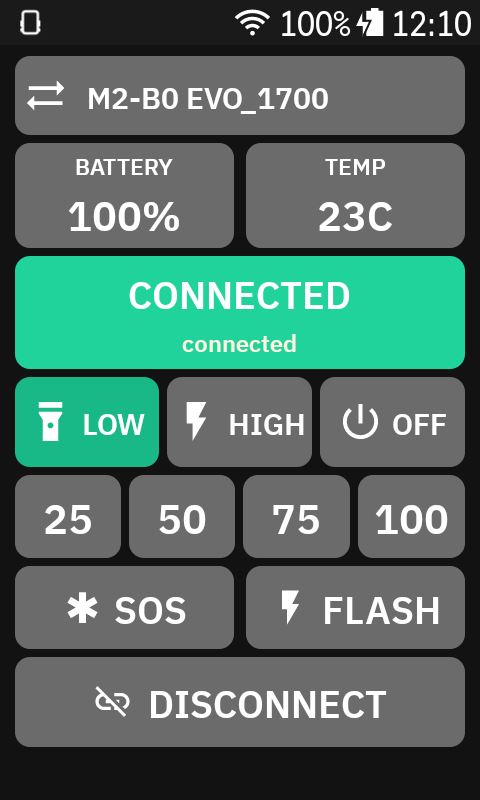

# Karoo Magicshine Controls

Karoo app and Karoo extension for controlling a Magicshine light over BLE.

## About

Magicshine Controls is a Karoo app plus ride-field extension for controlling supported Magicshine lights over BLE.

- Karoo-native control screen with telemetry
- in-ride split field for quick light toggle or app launch
- selection gate for supported lamp families

## Release Notes

### Beta 1.2

- added ride screen button
- added lamp selector gate
- added support for `M2-B0` / `M2-BO` / `M1-B0` / `M1-BO` lamps
- improved ride auto-connect and disconnect
- improved app and ride state sync
- refreshed icon and app metadata

## Supported Light Families

The current selector gate looks for BLE names starting with:

- `M2-B0`
- `M2-BO`
- `M1-B0`
- `M1-BO`

## Karoo Flow

1. Open the app on the Karoo.
2. Choose the lamp once in the selection gate.
3. Press `CONNECT`.
4. Wait for the short connect blink.
5. Choose `LOW`, `HIGH`, or `OFF`.
6. Use `25`, `50`, `75`, `100`, `SOS`, or `FLASH`.
7. Press `DISCONNECT` when finished.

## Current Caveats

- The current implementation is tuned to the tested light variant, not the full Magicshine product line.
- The Karoo UI is the primary target; generic phone layouts are not a focus yet.

## License

MIT License
